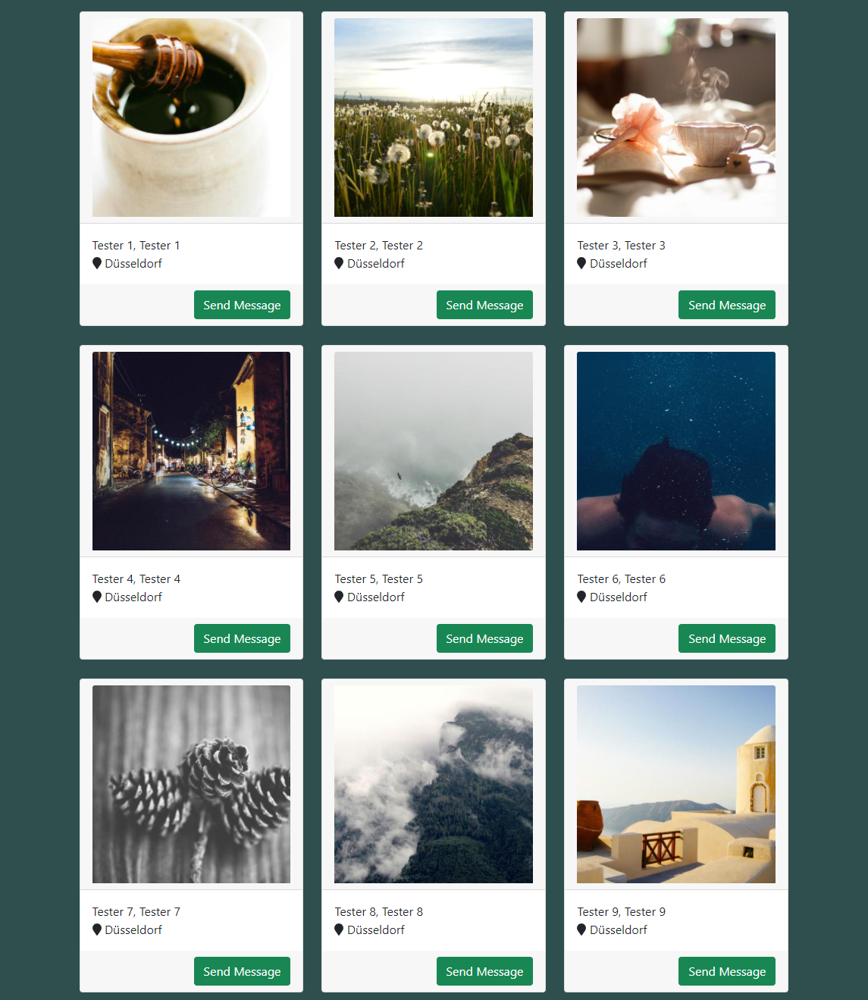

# Coding Interview

Build a static webpage which does have the following requirements !

## Tasks:
- build a basic container layout with bootstrap
- it should consist of 9 user cards
- fetch the users via an http request from a static users.json file
- incorporate the user information into a html template
- user cards should consist of a user image in the head of the card a firstname, lastname and city in the body and a button on the footer
- the user images should be randomly selected and should be different every time when it gets called via the lorem picsum service
- the city should also have a font-awesome icon -> map marker
- every card should be spaced equaly to the other
- cards should link to the users profile when they get clicked. the users profile is reachable on the url “/user/:id”
- clicking on the "send message" button should open a message modal

## Additional Tasks (Optional)
- instead of using staticly served css and js files use the webpack module bundler to build a packaged js/css file
## Tips and Resources:

- [Bootstrap 4 CSS CDN](https://stackpath.bootstrapcdn.com/bootstrap/4.1.3/css/bootstrap.min.css)
- [FontAwesome 5 JS CDN](https://cdnjs.cloudflare.com/ajax/libs/font-awesome/5.15.4/js/all.min.js)
- [Jquery 3.6.1 JS CDN](https://cdnjs.cloudflare.com/ajax/libs/jquery/3.6.0/jquery.min.js)
- [Axios JS CDN](https://cdnjs.cloudflare.com/ajax/libs/axios/0.21.1/axios.min.js)
- [Popper JS CDN](https://cdnjs.cloudflare.com/ajax/libs/popper.js/1.12.9/umd/popper.min.js)
- [Bootstrap JS CDN](https://maxcdn.bootstrapcdn.com/bootstrap/4.0.0/js/bootstrap.min.js)
- [Lorem Picsum Mirror](https://picsum.photos/350/350)

## Preview Picture

